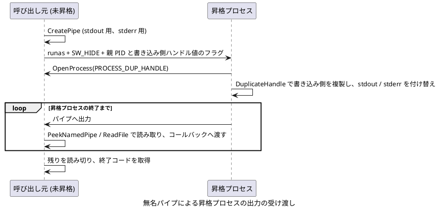

# runtime - 実行時補助ユーティリティ

`runtime` は、実行時にホストやモジュール、プロセスの情報を取得したり、外部ライブラリの関数を動的に解決したりするためのユーティリティ群です。  
公開ヘッダーは `cplat/runtime/` 配下に関心ごとに分割しています。

## 目的

共有ライブラリやプラグイン型の構成では、実行時に「自分がどこからロードされたか」「どの関数実装を外部ライブラリへ委譲するか」を知りたい場面があります。  
このモジュールは、そのための最低限の共通部品を提供します。

- 現在のホストの DNS ホスト名を UTF-8 で取得できます。
- 関数アドレスから所属モジュールのパスや basename を取得できます。
- 設定ファイルに基づいて関数シンボルを動的に解決できます。
- 解決結果をキャッシュし、同じ関数を繰り返し高速に呼べる
- Linux と Windows のローダー API 差異を吸収できます。

## 構成

### module_info

`module_info` は、指定した関数アドレスが属するモジュールの情報を取得する機能です。

- `cplat_module_get_path`: モジュールの絶対パスを取得します。
- `cplat_module_get_basename`: モジュールの basename を取得します。

典型的には、ロード中の共有ライブラリ自身の名前から設定ファイル名やログ識別子を組み立てる用途で使います。

### host

`host` は、現在のホストを識別する情報を取得する機能です。

- `cplat_host_get_name`: DNS ホスト名を UTF-8 で取得します。
- `CPLAT_HOST_NAME_MAX`: ホスト名格納用の推奨配列サイズ (NUL 終端込み)

Linux では `gethostname`、Windows では `GetComputerNameExW(ComputerNameDnsHostname)` を使用します。  
返る値は OS が保持する DNS ホスト名であり、FQDN であることは保証しません。

### process_info

`process_info` は、現在のプロセスの実行ファイル本体の情報取得と、Linux/Windows での子プロセス起動を担う機能です。管理者権限確認や昇格起動の責務は持たず、コンソール コンポーネントにも依存しません。

- `cplat_process_get_executable_path`: プロセスの実行ファイル絶対パスを取得します。
- `cplat_process_start` / `cplat_process_wait` / `cplat_process_get_exit_code` / `cplat_process_terminate` / `cplat_process_dispose`: 子プロセスの起動・待機・終了コード取得・強制終了・破棄
- `cplat_process_run_sync`: 子プロセスを起動し、終了まで同期的に待機します。

`cplat_module_get_path()` は関数アドレスが属するモジュールを返すため、Windows では DLL を指す場合があります。`cplat_process_get_executable_path()` は常にプロセス本体 (`.exe`) のパスを返します。  
典型的には、サービス登録時の `ExecStart` や SCM の `binPath` 設定に使います。

### elevated_process

`elevated_process` は、管理者/root 権限の確認と、必要に応じた昇格プロセスの起動を担う機能です。プロセスの待機・終了コード取得・破棄は `process_info` を再利用しますが、`process_info` 側が `elevated_process` に依存することはありません。

- `cplat_elevated_process_is_elevated`: 現在のプロセスが管理者/root 権限で動作しているかを確認します。
- `cplat_elevated_process_run_if_needed`: 管理者/root 権限が必要な処理のため、必要に応じて昇格実行します。
- `cplat_elevated_process_run_with_result`: 同様に昇格実行し、昇格プロセスが報告した結果メッセージを取得します。
- `cplat_elevated_process_extract_result_target` / `cplat_elevated_process_report_result`: 昇格プロセス側で結果メッセージを報告します。
- `cplat_elevated_process_run_piped`: 同様に昇格実行し、昇格プロセスの標準出力と標準エラー出力を無名パイプで受け取ります。
- `cplat_elevated_process_attach_output_pipes`: 昇格プロセス側で、標準出力と標準エラー出力を呼び出し元のパイプへ接続します。

`cplat_elevated_process_run_if_needed()` は、権限が必要な処理の入口で呼び出します。Windows では未昇格の場合に UAC を要求して現在の実行ファイルを再起動し、Linux では実効ユーザー ID が root でなければ失敗します。Windows で親にコンソールがある場合は、昇格プロセスのコマンド ラインへ親プロセス ID と親コンソールの window ハンドルを引き継ぎフラグとして付与します。昇格プロセス側は `cplat_console_attach_parent()` でこれを検出し、親コンソールへ確実に再接続したことを確認したうえで出力を元のコンソールへ戻します。

ただし、UAC 昇格直後の親コンソール再割り当ては、実機調査の結果、`AttachConsole` 後の安定待ちを満たしてもなお間欠的に書き込み不能 (`ERROR_INVALID_HANDLE`) になることがあり、原因を特定できていません。確実に結果を表示したい場合は `cplat_elevated_process_run_with_result()` を使ってください。こちらは昇格プロセスのコンソールを一切引き継がず、結果メッセージを一時ファイル経由で受け渡します。昇格プロセス側は起動直後に `cplat_elevated_process_extract_result_target()` を呼び出し、処理結果を `cplat_elevated_process_report_result()` で報告します。呼び出し元プロセス (常に未昇格、かつ自分自身の正常なコンソールを保持している) が、そのメッセージを `printf`/`fprintf` で表示します。

昇格プロセスの出力を逐次、そのまま表示したい場合は `cplat_elevated_process_run_piped()` を使ってください。呼び出し元は stdout 用と stderr 用の無名パイプを作成し、自分の PID と、パイプの書き込み側のハンドル値を内部フラグとして昇格プロセスへ渡します。UAC 昇格 (`ShellExecuteExW` の `runas` 動詞) ではハンドルを継承できませんが、昇格プロセスは同じユーザーの未昇格プロセスを `PROCESS_DUP_HANDLE` で開けます。そこで昇格プロセス側は、起動直後に呼び出す `cplat_elevated_process_attach_output_pipes()` で、書き込み側を `DuplicateHandle` により自分へ複製します。そのうえで、Win32 の標準ハンドルと CRT の stdout / stderr を付け替えます。

呼び出し元は昇格プロセスの終了を待つ間もパイプを読み続け、読み取った内容をコールバックへ渡します。コールバックに NULL を指定した場合は、自分の stdout / stderr へそのまま書き込みます。この方式では、昇格プロセスがコンソールへ一切書き込まないため、前述の `ERROR_INVALID_HANDLE` の影響を受けません。また、呼び出し元の出力がリダイレクトされている場合も、昇格プロセスの出力はそのリダイレクト先へ届きます。



CodeBlock: 無名パイプによる昇格プロセスの出力の受け渡し

stdout と stderr は別のパイプで受け取るため、両者の間の出力順序は保証しません。昇格プロセスの標準入力は `NUL` デバイスへ付け替え、呼び出し元からは渡しません。未昇格のプロセスから、昇格プロセスを入力で操作できないようにするためです。

### sym_loader

`sym_loader` は、設定ファイルで指定した `lib_name` / `func_name` を使って関数ポインターを解決する機構です。  
オーバーライド可能な関数や、実行環境によって差し替える関数の呼び出しに向いています。

- `CPLAT_SYM_LOADER_ENTRY_INIT`: 静的エントリ初期化
- `cplat_sym_loader_init`: 設定ファイル読み込み
- `cplat_sym_loader_resolve_as`: 型付きで関数ポインター取得
- `cplat_sym_loader_is_default`: 明示的既定値設定か確認
- `cplat_sym_loader_info`: 現在状態のダンプ
- `cplat_sym_loader_dispose`: 後始末

## 設計の要点

### module_info

`module_info` は、関数アドレスを手掛かりにして所属モジュールを特定します。

- Linux では `dladdr()` と `realpath()` を使用します。
- Windows では `GetModuleHandleEx()` と `GetModuleFileNameW()` を使用します。
- basename 取得時は拡張子を取り除きます。

そのため、設定ファイル名を `<basename>_extdef.jsonc` のように組み立てる用途と相性が良い構成です。

### sym_loader

`sym_loader` は、`func_key` ごとの解決情報を `cplat_sym_loader_entry` に保持します。  
初回解決時にライブラリ ロードとシンボル探索を行い、その結果をキャッシュします。

- Linux では `dlopen` / `dlsym` を使用します。
- Windows では `LoadLibrary` / `GetProcAddress` を使用します。
- 解決処理は内部ロックで保護されます。
- 1 度解決した結果はエントリ内へ保持されます。
- 設定ファイルの JSONC 解析には cjson の拡張 API を利用します。

## sym_loader の利用手順

### エントリを静的定義する

```c
static cplat_sym_loader_entry sfo_sample_func =
    CPLAT_SYM_LOADER_ENTRY_INIT("sample_func", sample_func_t);
```

### エントリ配列を用意する

```c
cplat_sym_loader_entry *const fobj_array[] = {
    &sfo_sample_func,
};
```

### ロード時に設定ファイルを読む

```c
cplat_sym_loader_init(fobj_array, fobj_length, configpath);
```

### 呼び出し時に型付きで解決する

```c
sample_func_t fp = cplat_sym_loader_resolve_as(&sfo_sample_func, sample_func_t);
if (fp != NULL) {
    return fp(a, b, result);
}
```

### アンロード時に解放する

```c
cplat_sym_loader_dispose(fobj_array, fobj_length);
```

## 設定ファイル形式

`cplat_sym_loader_init` が読む設定ファイルは、`func_key` をキーにした JSONC object です。  
`//` 行コメント、C 形式のブロック コメント、末尾カンマを利用できます。

```jsonc
// sample_func を外部実装へ委譲する例
{
  "sample_func": {
    "lib": "sample_override",
    "func": "sample_func_impl",
  },
}
```

- ルートは JSONC object です。
- 各プロパティ名が `func_key` に対応します。
- 値は object で、文字列フィールド `lib` と `func` を持ちます。
- `//` 行コメントおよび C 形式のブロック コメントを利用できます。
- オブジェクトと配列の末尾カンマを利用できます。
- 必須フィールド欠落、型不正、未知の `func_key`、名称長超過のエントリは無視します。
- ファイル未存在、読取失敗、JSONC 解析失敗は無視します (エントリは未設定のまま)。

`lib` と `func` の両方に `default` を指定した場合は、明示的に既定実装を使う設定として扱われます。

## 使い方

### module_info

共有ライブラリ自身の basename を取得して、設定ファイル名を組み立てる例です。

```c
#include <cplat/runtime/module.h>

char basename[256] = {0};
if (cplat_module_get_basename(basename, sizeof(basename), (const void *)onLoad) == 0) {
    /* basename を使って設定パスを決める */
}
```

### sym_loader

関数を外部実装へ委譲できるようにする基本形です。

```c
#include <cplat/runtime/sym_loader.h>

typedef int (*sample_func_t)(int a, int b, int *result);

static cplat_sym_loader_entry sfo_sample_func =
    CPLAT_SYM_LOADER_ENTRY_INIT("sample_func", sample_func_t);

int sample_func(int a, int b, int *result)
{
    sample_func_t fp = cplat_sym_loader_resolve_as(&sfo_sample_func, sample_func_t);
    if (fp != NULL) {
        return fp(a, b, result);
    }

    *result = a + b;
    return 0;
}
```

## プラットフォームごとの動作

### Windows

- `module_info` は Win32 API ベースで DLL パスを取得します。
- `process_info` は UAC を使った昇格再起動に対応します。
- `sym_loader` は `.dll` を内部で補完してロードします。
- ロックは `cplat_local_lock` を使用します。

### Linux / 非 Windows

- `module_info` は `dladdr()` ベースで `.so` の位置を特定します。
- `process_info` は root 権限の確認を行います。
- `sym_loader` は `.so` を内部で補完してロードします。
- ロックは `cplat_local_lock` を使用します。

## 注意点

- `cplat_sym_loader_init` と `cplat_sym_loader_dispose` は constructor / destructor や `DllMain` から呼ぶ前提です
- `cplat_sym_loader_dispose` はその前提に合わせてロックを取らずに解放します
- `sym_loader` はライブラリ名に拡張子を含めず設定します
- 解決失敗時は `cplat_sym_loader_resolve_as` が `NULL` を返すため、呼び出し側で既定処理を持つ設計が基本です
- オーバーライド実装側から元の関数を再帰的に呼ぶ構成は避けてください

## 関連ヘッダー

- `cplat/runtime/host.h`: ホスト識別情報取得
- `cplat/runtime/module.h`: モジュール情報取得
- `cplat/runtime/process.h`: プロセス情報取得
- `cplat/runtime/sym_loader.h`: 動的シンボル解決
